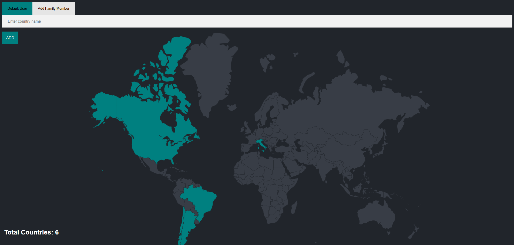

# Country Tracker App 🌍

This is a simple web application that allows users to track which countries they have visited. It is built with **Node.js**, **Express**, **PostgreSQL**, and **EJS**.

## Preview



## Features

- Add countries you've visited using country names.
- Create and switch between users.
- Save visited countries to a PostgreSQL database.
- Dynamic interface with customizable user colors.

## Technologies Used

- Node.js
- Express.js
- PostgreSQL
- EJS (Embedded JavaScript Templates)
- Body-Parser
- Dotenv

## Project Structure

```
├── public/
│   └── styles/
│       ├── images/
│       │   └── preview.png
│       ├── main.css
│       └── new.css
├── views/
│   ├── index.ejs
│   └── new.ejs
├── .env
├── .gitignore
├── index.js
├── package.json
└── package-lock.json
```

## Getting Started

### Prerequisites

- Node.js
- PostgreSQL

### Setup

1. Clone this repository:
```bash
git clone https://github.com/yourusername/country-tracker-app.git
cd country-tracker-app
```

2. Install dependencies:
```bash
npm install
```

3. Create a `.env` file based on the example below and update with your database credentials:

```
PG_USER=your_username
PG_PASSWORD=your_password
PG_HOST=localhost
PG_PORT=5432
PG_DATABASE=your_database
```

4. Create the required tables in your PostgreSQL database:

```sql
CREATE TABLE users (
  id SERIAL PRIMARY KEY,
  name VARCHAR(255),
  color VARCHAR(50)
);

CREATE TABLE countries (
  country_code VARCHAR(5) PRIMARY KEY,
  country_name VARCHAR(255)
);

CREATE TABLE visited_countries (
  id SERIAL PRIMARY KEY,
  country_code VARCHAR(5),
  user_id INTEGER REFERENCES users(id)
);
```

5. Run the application:
```bash
node index.js
```

6. Visit: [http://localhost:3000](http://localhost:3000)

## 🧑‍🏫 Credits

This project was developed as part of the [The Complete 2024 Web Development Bootcamp](https://www.udemy.com/course/the-complete-web-development-bootcamp/) by Dr. Angela Yu.

## Author

Developed by Gustavo Avila.
